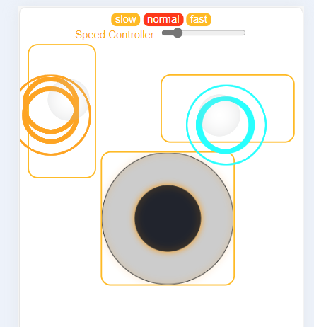

# ESP8266 Remote Control

## Introduction

This repostory is for a general remote control using esp8266. Esp8266 is seted as AP mode and using wifi name: Mowwifi and wifi password: 123456789.
There is a embedded html website inside the .ino, the website contains 3 buttons(for adjustig moter speed), two seperate joysticks, left one is for forward and backward(linear speed), right one is for left and right(rotation speed) and a all direction joystick for both control. The website can be entered with url: 192.168.4.1

## Libraries or Configurations in Arduino IDE

1. Download and install support for esp8266
    
    Open the Arduino IDE and select File -> Preferences from the menu. Enter the following URL in the Preferences dialogue box that opens and click OK:
     **http://arduino.esp8266.com/stable/package_esp8266com_index.json**  

    Next, select "Tools" -> "Boards" -> "Board Manager" from the menu, and then type " ESP8266" in the search box. Click on "esp8266 by ESP8266 Community" in the search results to install support.

2. Choose development board

    Select "Tools" -> "Boards" from the menu, and then select the corresponding board.

3. Install Aduino library
    * ESP8266WiFi.h
    * ESPAsyncWebServer.h
    * ESPAsyncTCP.h 

## Usage

1. Install required Library

2. Compile and burn the code into esp8266 using Arduino

3. Connect to the wifi and open the url in browse

4. As a general remote control tool, it will send the linear speed and also rotation speed to the motor in a range (1-100)